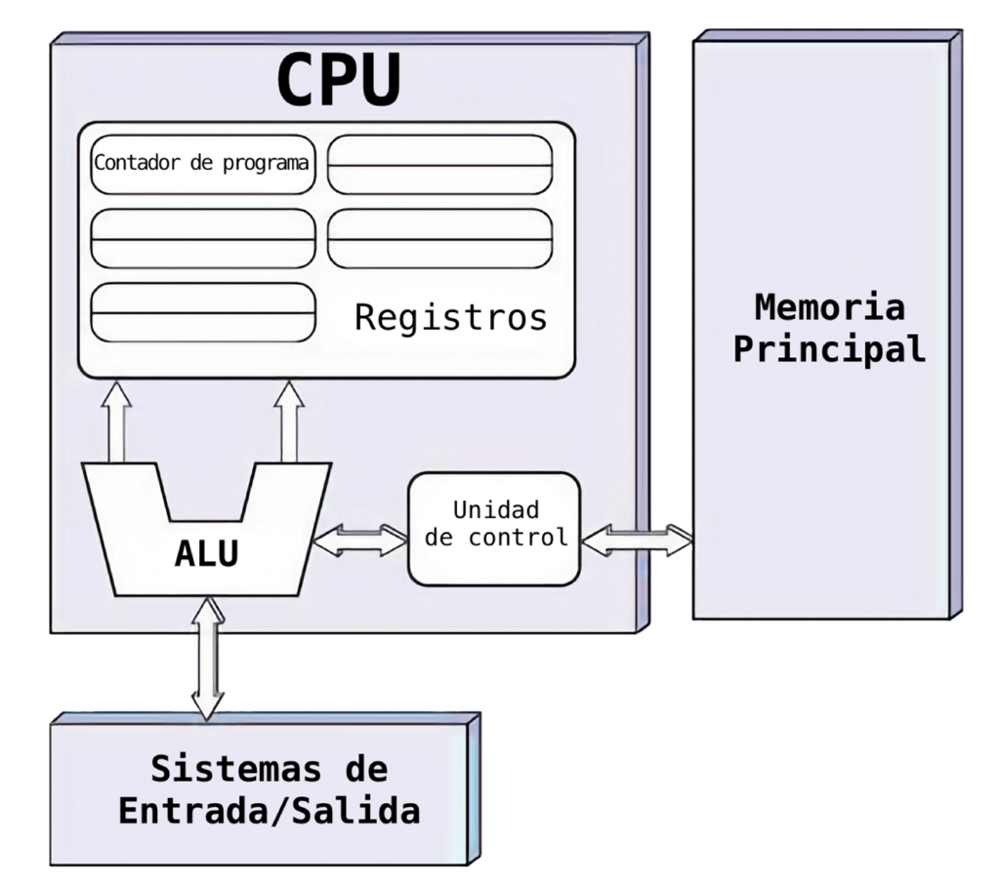
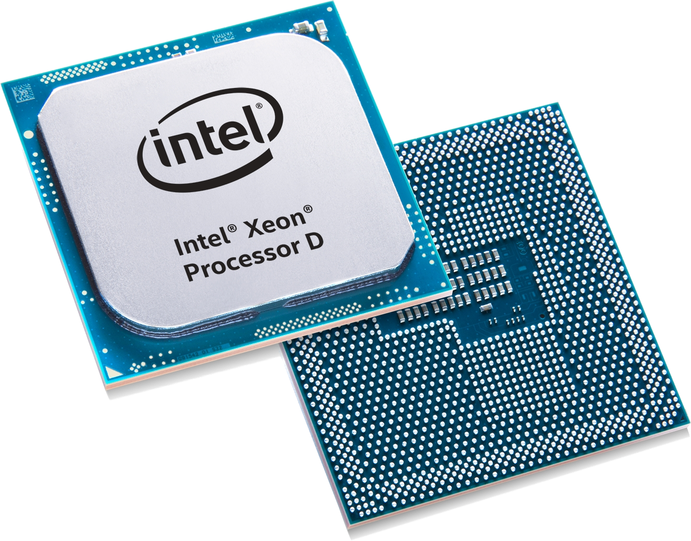
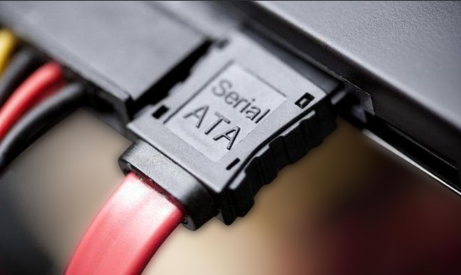
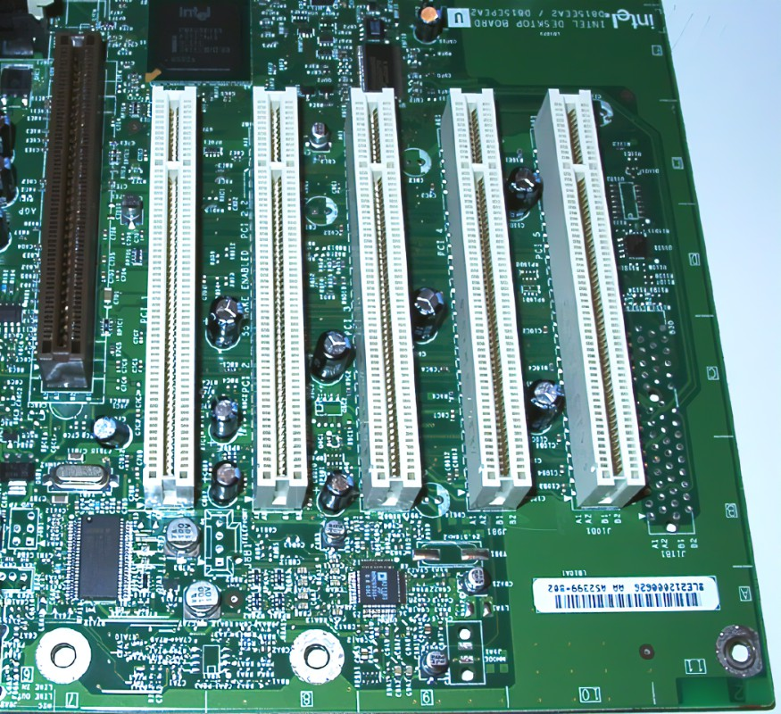

# ARQUITECTUTA VON NEUMANN

Von Neumann describió la construcción de un ordenador electrónico con programa almacenado, conectando permanentemente sus unidades para un funcionamiento coordinado bajo un control central. 
Esta arquitectura, con pequeños cambios, es la base de la mayoría de ordenadores actuales.

## 2.1. CPU(Unidad central de proceso)
Es el cerebro del ordenador que controla el sistema, interpreta y ejecuta instrucciones, procesa datos de entrada y los envía a periféricos de salida. La potencia del sistema se mide por la CPU.

 Está formada por:
- __Unidad de control (UC):__ Interpreta y ejecuta las instrucciones máquina almacenadas en la memoria principal y genera las señales de control necesarias para 
ejecutarlas.

- __Unidad aritmético-lógica (UAL o ALU):__ Se encarga de realizar operaciones matemáticas, comparaciones y evaluaciones lógicas basandose en el álgebra de Boole,devolviendo resultados bajo la supervisión de la unidad de control.

- __Registros de trabajo:__ Los registros de trabajo almacenan información temporal y, junto con la UC y la UAL, forman el procesador central, encargado del control y ejecución de las operaciones del sistema;similar al microprocesador (Intel, AMD).

- __Buses:__ Caminos a través de los que las instrucciones y los datos circulan entre las distintas unidades del ordenador(Interconecta al CPU con los sistemas de almacenamiento y periféricos).

## 2.2. La unidad de control
Interpreta y ejecuta las instrucciones máquina que conforman los programas y de generan las señales 
de control necesarias para llevarlas a cabo.

## 2.3. Unidad aritmético-lógica (UAL)

Ejecuta operaciones aritméticas y lógicas según las ordenes de la UC,utilizando códigos de operación y direcciones de memoria.
Su componente clave es la FPU que realiza cálculos con números fraccionarios y operaciones matemáticas .

## 2.4. Los registros internos del microprocesador
Celdas de memoria de internas en el procesador de alta velocidad que permiten a la CPU almacenar datos temporalmente mientras se efectúa alguna operación. 

Están formados por un conjunto de bits que se manipulan en bloque. 

## 2.5. Buses de comunicación
Líneas eléctricas u ópticas a través de las cuales se comunican las distintas unidades de 
un ordenador.Los buses son cables por los que circula la información e  forma de bits. 

Tipos:
- __Bus de datos:__ Intercambia datos entre el CPU y otras unidades a través de líneas eléctricas paralelas.Su velocidad se mide en MHz o GHZ.

- __Bus de direcciones:__ Transmite direcciones entre la CPU y la memoria,funcionando de manera sincronizada con el bus de datos.

- __Bus de control de la CPU:__ Genera los impulsos eléctricos necesarios para gobernar el resto de elementos.